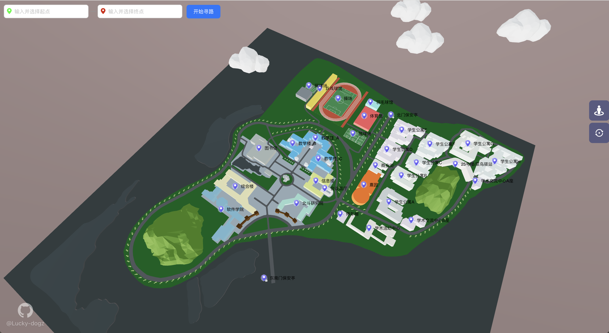
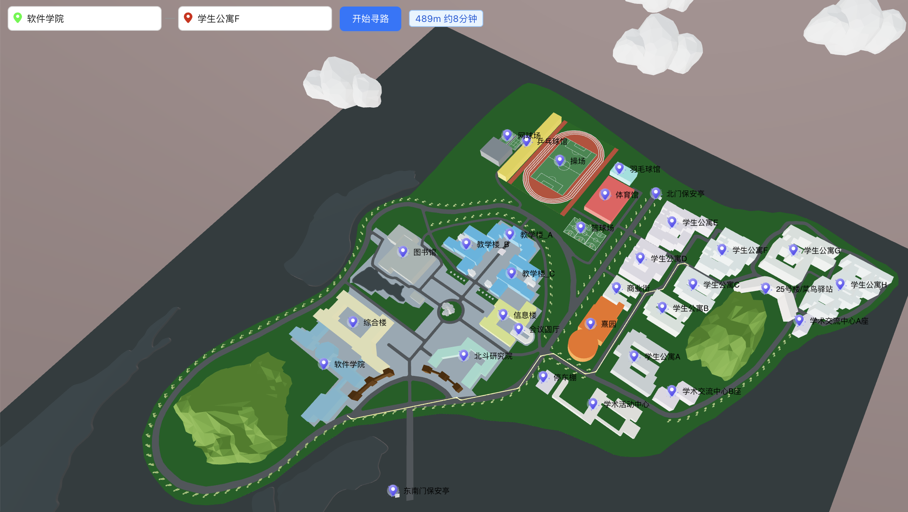
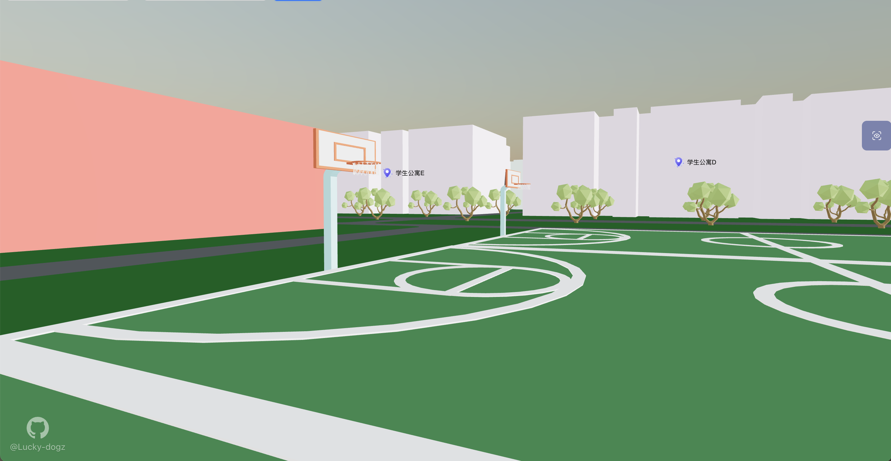

## 基于Three.js的三维校园导航系统

建模：ArcMap+ArcScene+Blender

开发：ThreeJs+React+TypeScript+Vite+Ant Design+Eslint+Prettier

功能：校园不同建筑之间的导航、建筑交互与信息展示、实时定位（修复中）、第一人称漫游功能...

非常感谢@[Dhruv Misra](https://github.com/dhruvmisra) 的 [Pathfinding-Visualizer-ThreeJS](https://github.com/dhruvmisra/Pathfinding-Visualizer-ThreeJS)，给予我很大参考和灵感



## 项目运行

```
npm install
npm run dev
```

## 路径规划

800*800m导航网格构建，采用A\*导航算法



## 实时定位

若网络允许✅，最好直接使用`Navigator.geolocation`，否则可以使用百度/高德地图的api获取当前位置经纬度（百度地图偏差较大😤），并进行墨卡托投影转换成平面坐标，与校园地图原点进行差值计算，最后映射转换到校园坐标系中。


## 建筑信息展示

使用动画平滑库Tween.js移动摄像机实现，放上你想要展示的关于这栋建筑的信息


## 第一人称漫游

主要借助**PointerLockControls**和**Raycaster**实现


